<a href="https://opensource.newrelic.com/oss-category/#new-relic-experimental"><picture><source media="(prefers-color-scheme: dark)" srcset="https://github.com/newrelic/opensource-website/raw/main/src/images/categories/dark/Experimental.png"><source media="(prefers-color-scheme: light)" srcset="https://github.com/newrelic/opensource-website/raw/main/src/images/categories/Experimental.png"></picture></a>


# Zoom Webhooks to New Relic Log API

Write Zoom Webhook Events to New Relic's Log API. 


## Installation


### Prerequisites
- Zoom Marketplace developer access
- Zoom requires an HTTPS connection with a TLS certificate from Certificate Authority (CA), *NOT SELF-SIGNED* certificate. If you need help with this see below in [Development](#Development)
- Docker installed and running on the target host


### Step 1: Install the app and get it ready to run
[//]: # (TODO create GitHub Releases)
- Ensure you have CA certificates, [see Development](#Development) below
- Build the Docker image  ( `docker build  --tag zoom-logger .` ) using this `Dockerfile`
```dockerfile
# syntax=docker/dockerfile:1

# Step 1: Build the application from source
FROM golang:1.21-alpine AS build-stage

WORKDIR /build

# The Go image does not include git, add it to Alpine
RUN apk add git

RUN git clone https://github.com/newrelic-experimental/ZoomWebhookToLog.git

WORKDIR ZoomWebhookToLog

# Install the application's Go dependencies
RUN go mod download

# Build the executable
RUN GOARCH=amd64 GOOS=linux go build -o /zoomLogger internal/main.go

# Step 2: Deploy the application binary into a lean image
FROM alpine AS build-release-stage

WORKDIR /

COPY --from=build-stage /zoomLogger /zoomLogger

# COPY certs in from a local location- for instance:
# NOTE: if you use mount to add the certs symlinks that are not a sub directory will not work- this is a Dockerism
COPY cert/privkey1.pem    ./key.pem
COPY cert/fullchain1.pem  ./cert.pem


# Neither ENTRYPOINT nor CMD support ENV variables so manually keep EXPOSE and "-Port" in-sync
EXPOSE 443

ENTRYPOINT ["/zoomLogger", "-Port", "443"]
```
- Prepare, but DO NOT run, the application to run as a detached process that can survive user logout. How to do this is beyond the scope of this document, here are some useful references:
  - [systemd on Linux] (http://tuxgraphics.org/npa/systemd-scripts/)
  - [User defined Service on Windows] (https://learn.microsoft.com/en-us/troubleshoot/windows-client/deployment/create-user-defined-service)
  - [Docker on Linux] (https://linux.how2shout.com/how-to-start-docker-container-automatically-on-boot-in-linux/)


## Step 2: Configuration
Configuration with defaults is self-describing for this application:
```bash
zoomProcessor -h
Usage of zoomProcessor:
  -CertFile string
    	Path to cert file (default "cert.pem")
  -FlushInterval int
    	Number of milliseconds to wait before flushing the Zoom Event buffer to New Relic (default 500)
  -FlushMaxSize int
    	Number of bytes to buffer before writing to the New Relic Log API (default 100000)
  -IngestKey string
    	New Relic Ingest key
  -KeyFile string
    	Path to key file (default "key.pem")
  -LogApiEndpoint string
    	New Relic Log API HTTP endpoint ( https://docs.newrelic.com/docs/logs/log-api/introduction-log-api/#endpoint )  (default "https://log-api.newrelic.com/log/v1")
  -LogLevel string
    	Golang slog log level: debug | info | warn | error (default "info")
  -Port string
    	Port to listen on for inbound Webhook events (default "443")
  -ZoomSecret string
    	Zoom webhook secret token from the Zoom Marketplace Add Feature page of this app
```

Configuration begins with command line arguments, which may then be overridden with environment variables.

File paths should be fully qualified to avoid problems. When using Bash,  relative paths are relative to the `PWD` envvar when the application is started. For instance, if the application is in `./bin` and the certs are in `./scratch`
```bash
bin/zoomProcessor -CertFile scratch/cert.pem  -IngestKey 1 -ZoomSecret 1 -KeyFile scratch/key.pem 
```
works


### Step 3: Zoom App Marketplace
- Login to the [Zoom App Marketplace](https://marketplace.zoom.us/). You *must* have Developer permissions.
- Pull down `Develop` in the top right corner and select `Build App` 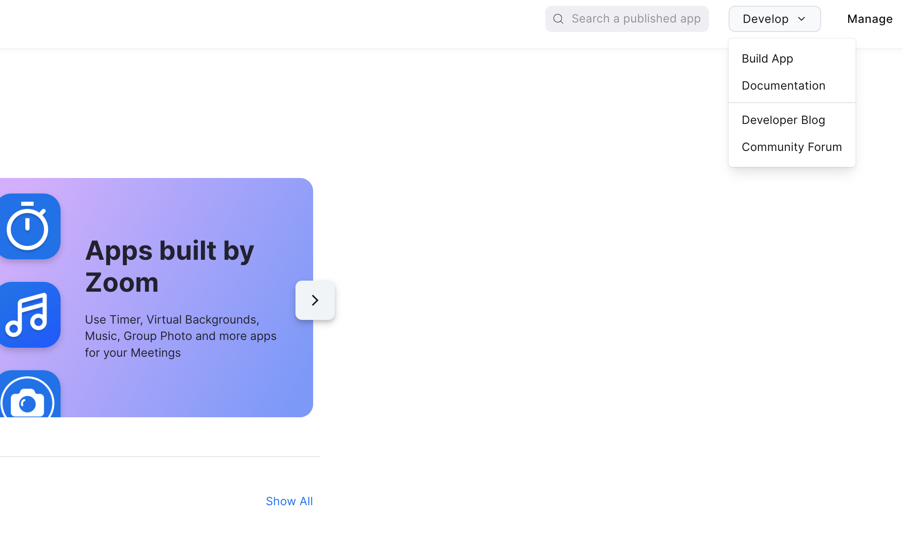
- Select `Create` under `Webhook Only` from `Choose your app type` 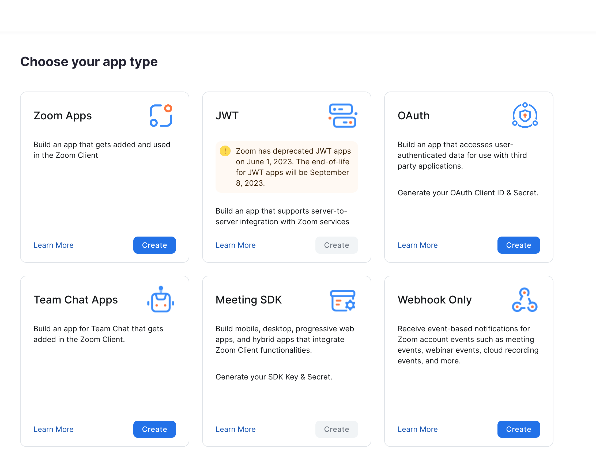 (*NOTE:* if you do not have Developer permissions you will not be able to click this button)
- Name your App in the `Create a Webhook app` dialog and press `Create` 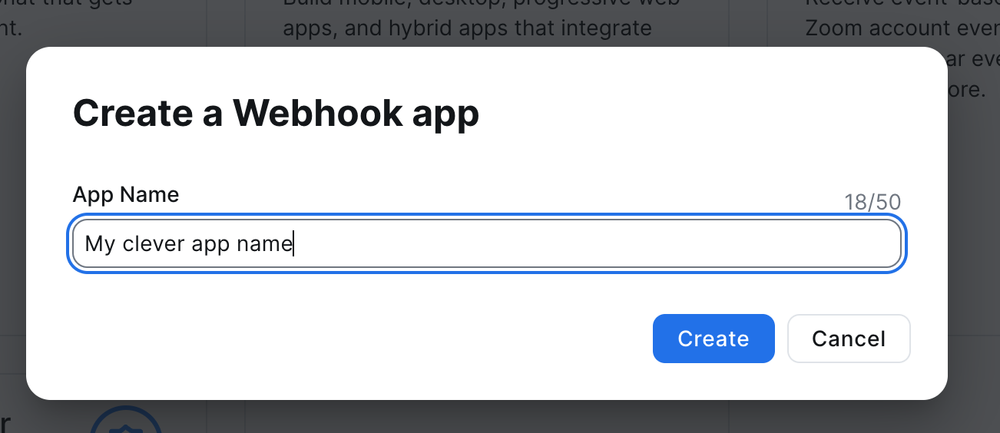
- Fill-in the `Information` for the App, all fields are required
  - For `Privacy`, `Terms`, and `Support` you may link to the respective `.md` files in this repository 
  - Press `Continue` 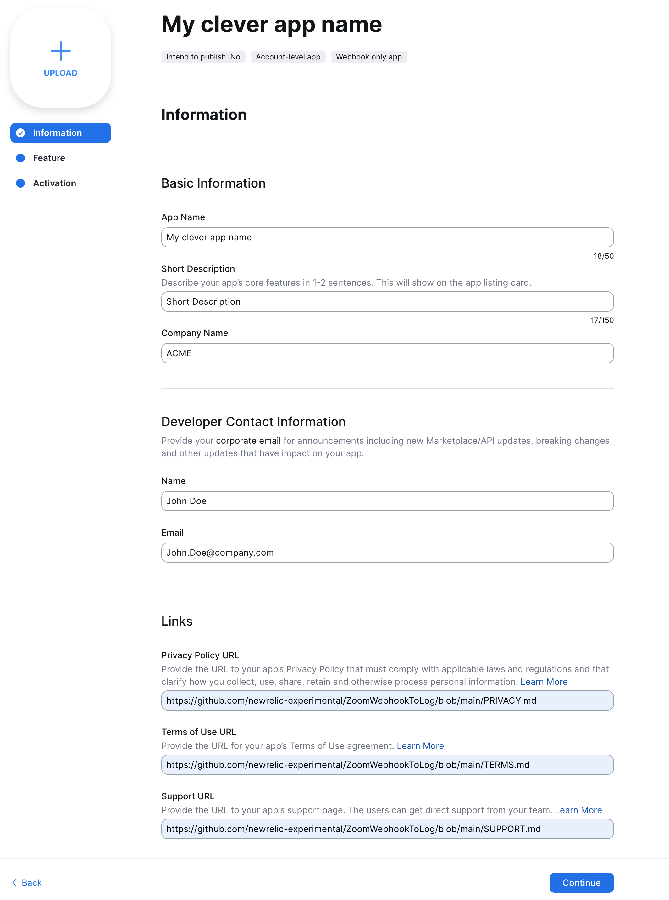
- On the `Feature` tab *save the `Secret Token`!*


### Step 4: Finish configuring the app and start it
- Add the `Secret Token` from _Step 3_ to the App's configuration
- Start the application, opening the `EXPOSE` port to the outside world
```bash
docker run  -p 443:443/tcp zoom-logger   -IngestKey YOUR_NEW_RELIC_INGEST_KEY  -ZoomSecret YOUR_ZOOM_SECRET -LogLevel info 
```


### Step 5: Go back to Zoom and finish setting-up the Webhook App
- From the `Feature` tab enable `Event Subsriptions` 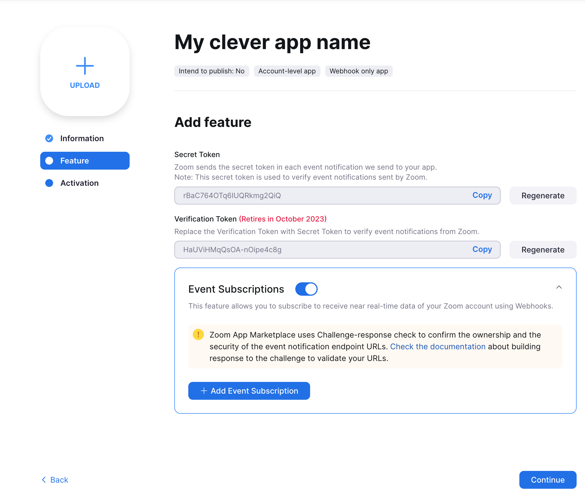 
- Fill in
  - Subscription name (optional)
  - Event notification endopoint URL (the web address of YOUR webhook)
- Click `Validate` 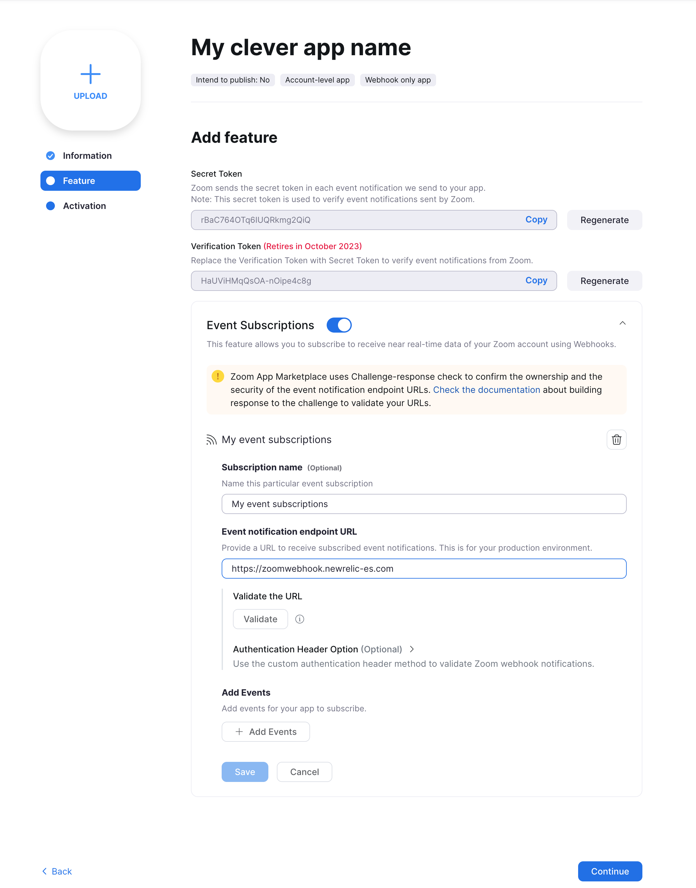
- Assuming everything is setup properly you can now `Add Events`. The comprehensive list of Webhook Events is [here](https://developers.zoom.us/docs/api/) 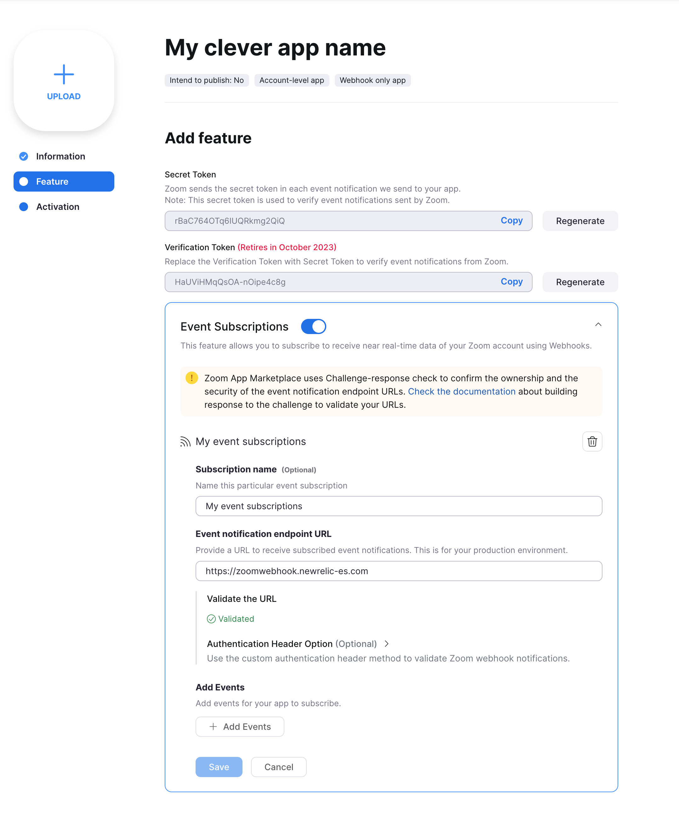
- Select the Events you want to log and press `Done` 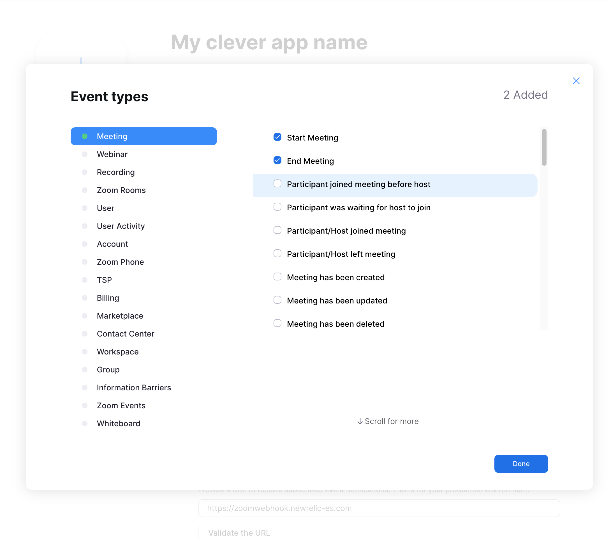
- Press `Save` and then `Continue` and your Webhook is activated 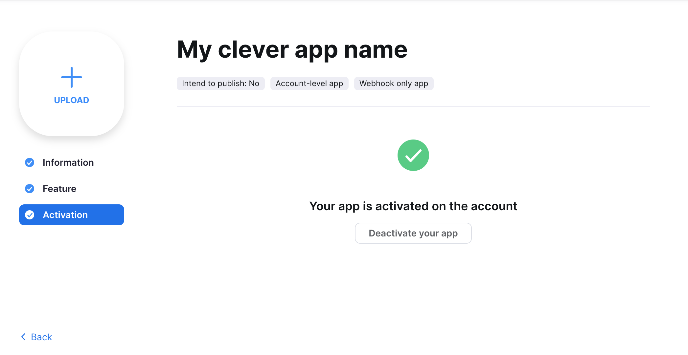


### Step 6: Go to New Relic and marvel at your Log data
- [Login into One New Relic](https://one.newrelic.com)
- Open `Query Your Data` 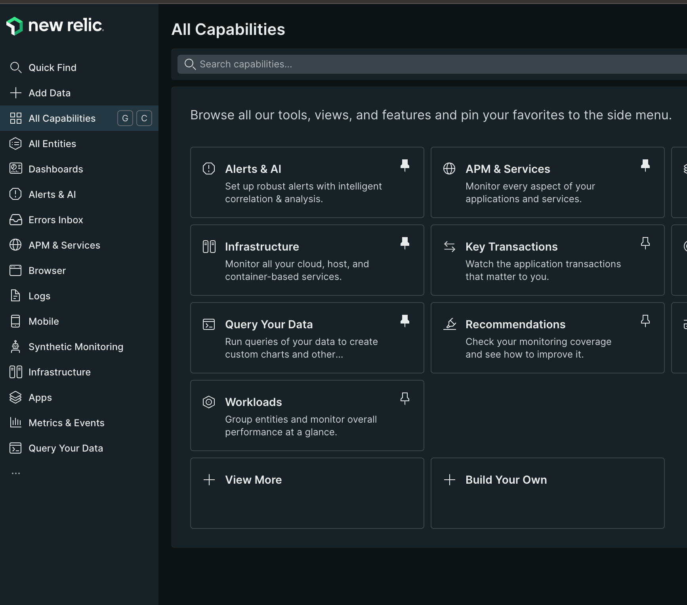
- Query the data using NRQL 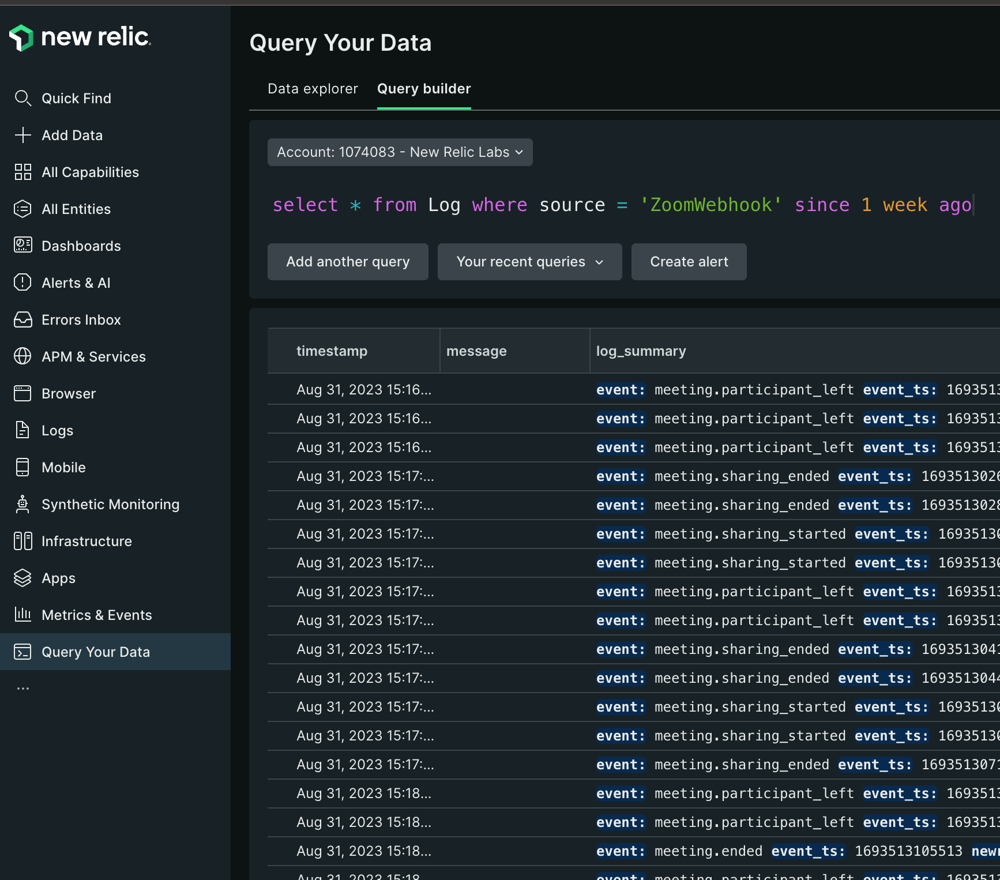 
  - `select * from Log where source = 'ZoomWebhook' since 1 week ago`


## TLS Certs
- Needs a cert & key pem
  - Needs permission to listen on 443
  - CANNOT BE SELF-SIGNED, try https://certbot.eff.org/instructions?ws=other&os=ubuntufocal


## Troubleshooting


## Building
[//]: # ( TODO test building from the release in a clean directory)
- Install Go 1.21 on the system
- Download the [Release](https://github.com/newrelic-experimental/ZoomWebhookToLog/releases)
- unzip/tar the Release
- cd into the Release directory
- `go mod download`


### Executable file
[See here](https://gist.github.com/asukakenji/f15ba7e588ac42795f421b48b8aede63) for a list of `GOOS` and `GOARCH` values. Requires `go 1.21`.
```bash
 GOOS=linux GOARCH=amd64 go build  -o bin/zoomProcessor  internal/main.go
 ```


## Development
- [Let's Encrypt](https://letsencrypt.org/) is a good, free, CA to get around the _no self-signing_ problem
  - [certbot](https://certbot.eff.org/instructions) works with _Let's Encrypt_
- [Zoom Webhook developer docs](https://developers.zoom.us/docs/api/rest/webhook-reference/)
- [Zoom example Webhook](https://github.com/zoom/webhook-sample/) written in NodeJS


## Support

New Relic has open-sourced this project. This project is provided AS-IS WITHOUT WARRANTY OR DEDICATED SUPPORT. Issues and contributions should be reported to the project here on GitHub.

We encourage you to bring your experiences and questions to the [Explorers Hub](https://discuss.newrelic.com) where our community members collaborate on solutions and new ideas.


## Contributing

We encourage your contributions to improve this project! Keep in mind when you submit your pull request, you'll need to sign the CLA via the click-through using CLA-Assistant. You only have to sign the CLA one time per project. If you have 
any questions, or to execute our corporate CLA, required if your contribution is on behalf of a company, please drop us an email at opensource@newrelic.com.

**A note about vulnerabilities**

As noted in our [security policy](../../security/policy), New Relic is committed to the privacy and security of our customers and their data. We believe that providing coordinated disclosure by security researchers and engaging with the security community are important means to achieve our security goals.

If you believe you have found a security vulnerability in this project or any of New Relic's products or websites, we welcome and greatly appreciate you reporting it to New Relic through [HackerOne](https://hackerone.com/newrelic).


## License

This project is licensed under the [Apache 2.0](http://apache.org/licenses/LICENSE-2.0.txt) License.

